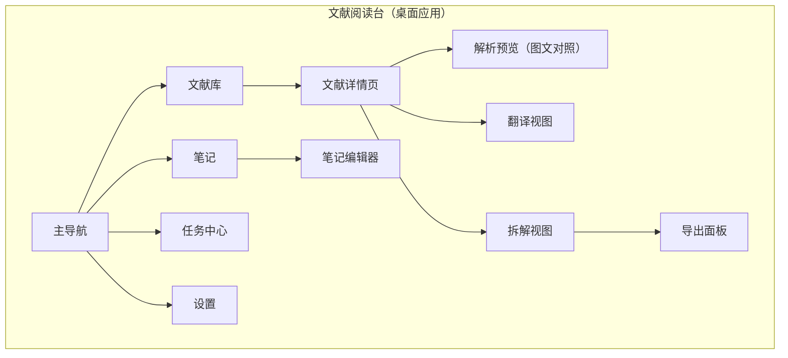
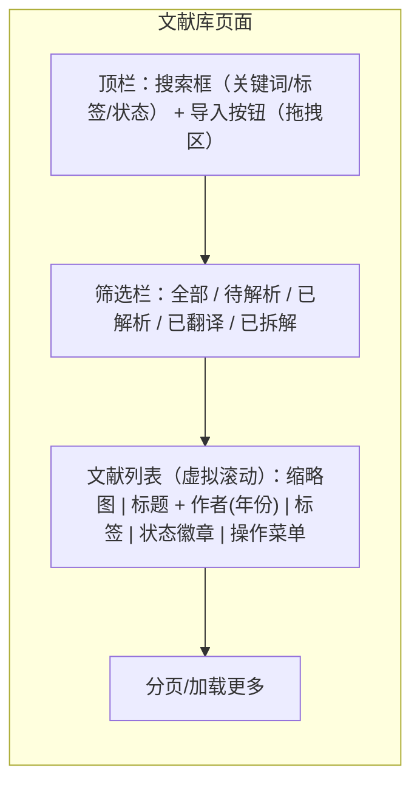
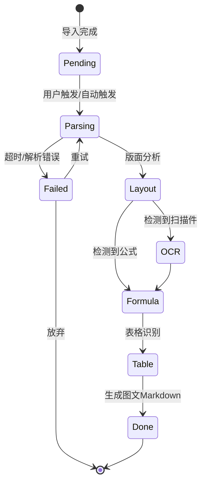
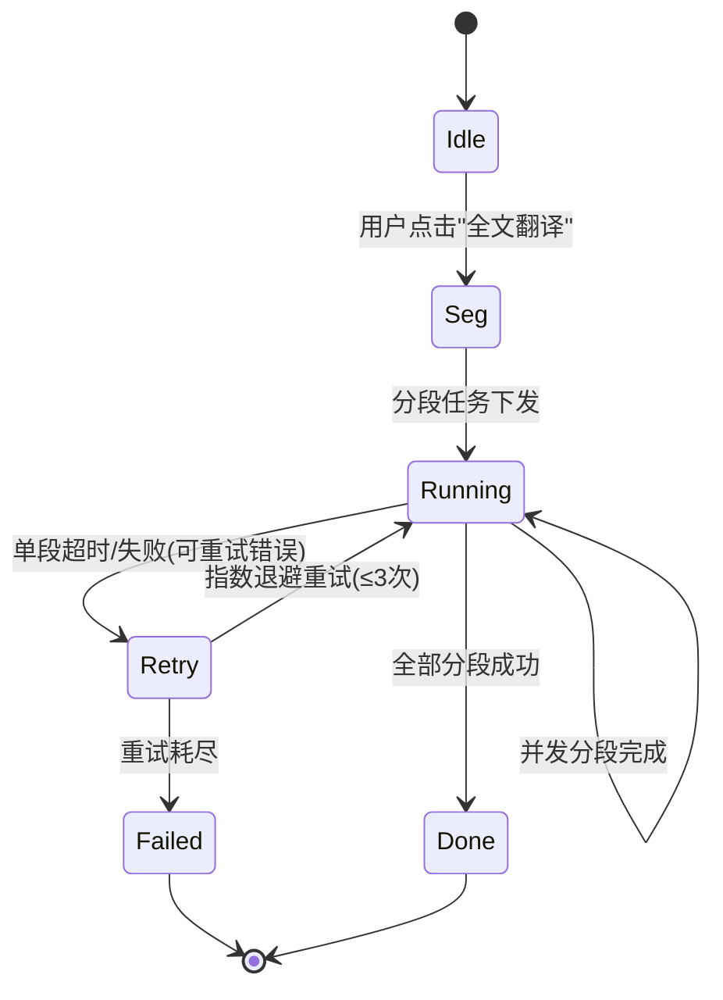
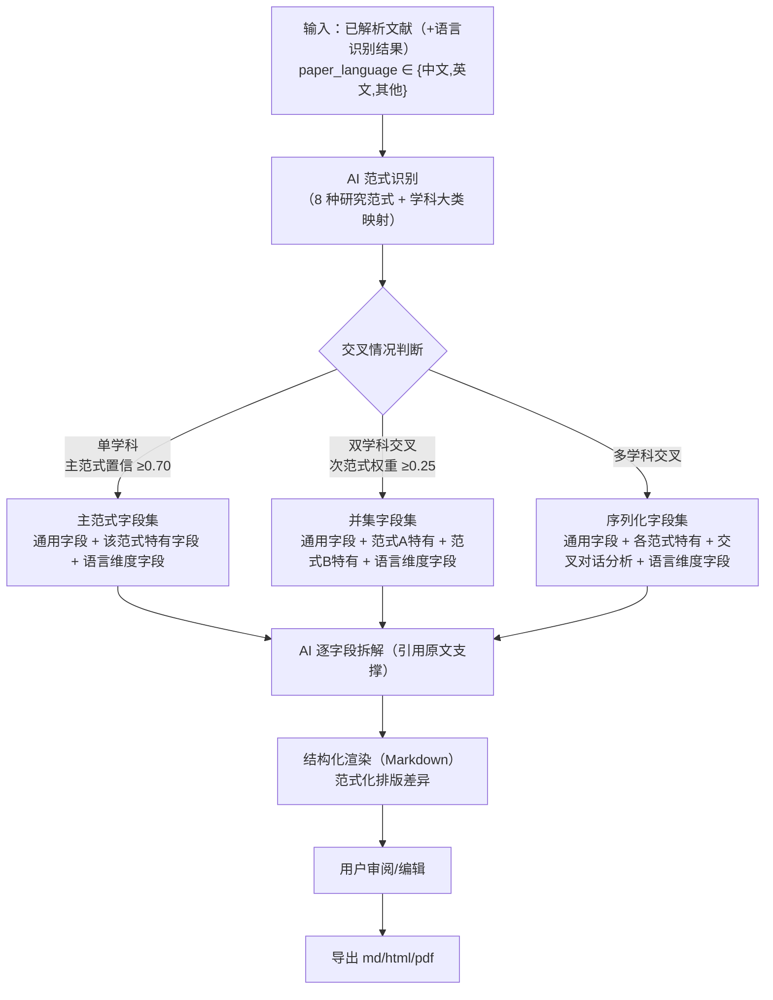
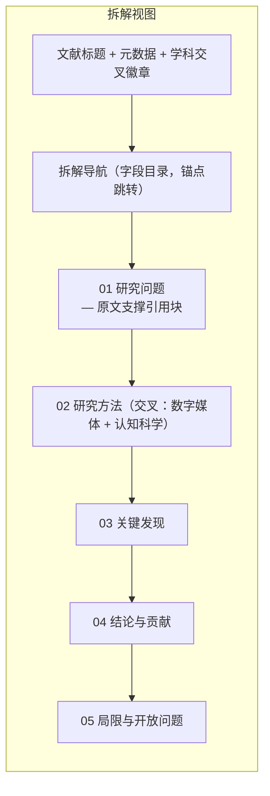
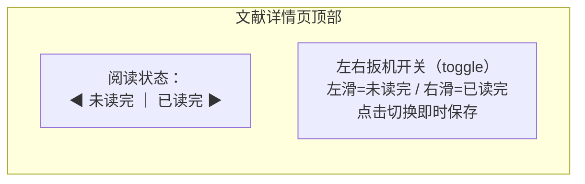
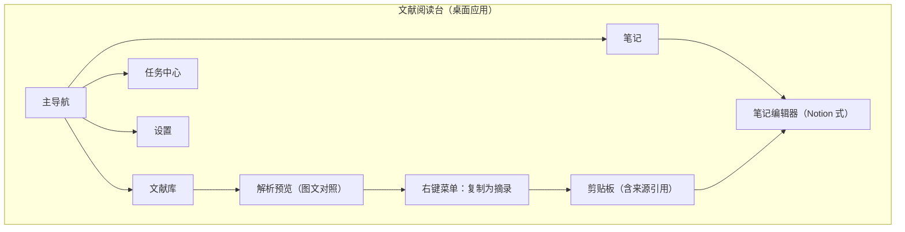
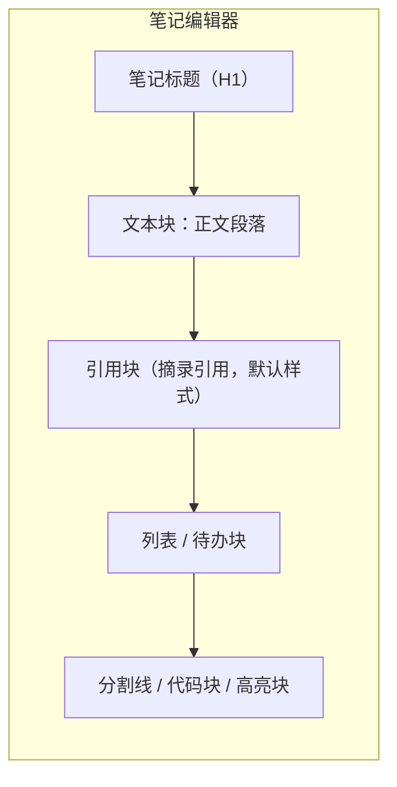
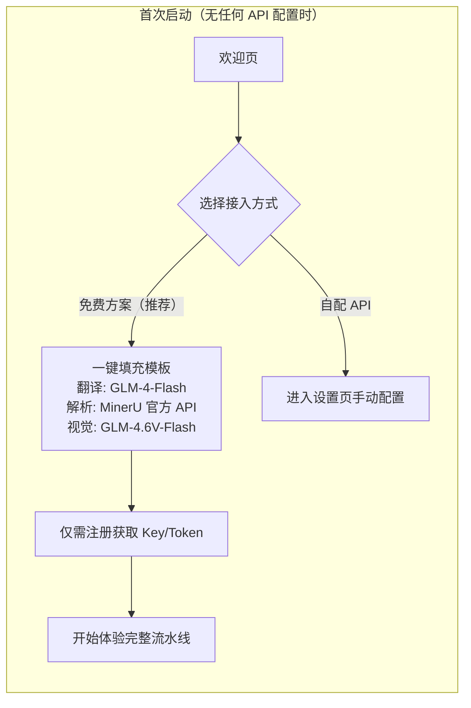

# 文献阅读台 PRD（产品需求文档）

创建日期：2026-08-21 ｜ 状态：Draft ｜ 产品形态：macOS 优先的本地桌面应用

---

## 1. 需求背景

### 1.1 业务背景与触发源

外文文献（尤其英文 PDF）是学术研究的核心输入，但研究者普遍面临三重障碍：

1. **语言障碍**：全文翻译工具质量参差，学术长文（30-60 页）分段翻译碎片化、术语不统一。
2. **结构理解成本高**：一篇文献读完不等于读懂，研究者需要按"研究问题→方法→实验→结论"的结构化拆解才能内化为知识，人工拆解耗时且漏项。
3. **格式碎片化**：翻译、拆解、笔记散落在不同工具（翻译软件 + 笔记软件 + 文献管理软件），无法形成"原文→解析→拆解→导出"的单一闭环。

项目触发源明确：用户（高校艺术学/数媒领域研究者）需要一条从 **PDF 外文文献 → MinerU 图文解析 → 大模型翻译 → AI 学科交叉识别 → 结构化拆解 → 渲染导出（md/html/pdf）** 的完整流水线，且全程本地优先、可自配 API。

证据强度：`[Expert judgment]`——由项目发起人直接提出，痛点描述具体但未做量化调研（如翻译耗时、拆解漏项率），量化数据待补充。

### 1.2 不解决的后果

- 研究者继续使用"翻译软件 + 手动笔记"的割裂工作流，单篇文献理解成本高、知识沉淀率低。
- 已翻译/已拆解内容无法复用与导出，无法沉淀为个人知识资产。

---

## 2. 产品目标

| # | 目标 | 成功标准 | 证据强度 |
|---|------|---------|---------|
| G1 | 缩短外文文献的"读懂并结构化"时间 | 单篇 30-60 页英文论文，从导入到获得结构化拆解 ≤ 15 分钟（不含 API 等待） | `[Hypothesis]` 待验证 |
| G2 | 保证拆解质量可用 | AI 拆解结果在 5 分制人工评分中 ≥ 4.0 分（见 §7 评估体系） | `[Hypothesis]` |
| G3 | 输出可复用资产 | 拆解结果可一键导出 md/html/pdf，且导出文件自包含（无需依赖应用即可阅读） | 可验证 |
| G4 | 本地优先、数据可控 | 除用户主动配置的翻译/拆解 API 调用外，文档内容不出本机 | 可验证 |

---

## 3. 竞争与市场概况（简版）

> 竞品数据来自上一轮公开调研与常识归类，具体功能差异矩阵 `[To be supplemented - requires manual research]`。

| 产品 | 定位 | 覆盖能力 | 与本产品的差异 |
|------|------|---------|---------------|
| Zotero | 文献管理 | 元数据管理、PDF 阅读、插件生态 | 无 AI 翻译/拆解原生能力 |
| ReadPaper | 在线文献阅读 | 翻译、笔记、AI 问答（在线） | 需上传文档到云端，不满足本地优先 |
| Scholarcy | AI 文献摘要（在线） | 摘要、关键点提取 | 无 MinerU 级版面还原，无学科交叉拆解 |
| MinerU | 文档解析引擎（开源） | 版面分析、OCR、公式表格识别 | 是**解析能力底座**而非完整产品，本产品将其封装为流水线第一环 |

**结论与机会**：市场上缺少"本地优先 + 版面级解析 + 大模型翻译 + 学科交叉感知的深度拆解 + 多格式导出"的单体桌面工具。本产品的差异化定位为：**学术研究者的本地文献加工流水线**，MinerU 提供版面还原保真度，AI 拆解提供结构化深度，本地优先保障隐私。

---

## 4. 用户与场景

### 4.1 目标用户 Persona

| 属性 | Persona A（核心） | Persona B（次核心） |
|------|------------------|---------------------|
| 身份 | 人文社科/交叉学科硕博研究生 | 高校青年教师/科研人员 |
| 熟练度 | 熟悉学术文献，不熟悉技术配置 | 同上，愿意自配 API |
| 使用频率 | 每周阅读 3-10 篇外文文献 | 每周 1-5 篇 |
| 决策权 | 工具选择自主 | 工具选择自主 |
| 痛点烈度 | 高（语言障碍 + 拆解耗时） | 高（批量阅读 + 知识管理） |
| API 付费意愿 | 中（可接受自带 Key 按量付费） | 高 |

### 4.2 角色说明

本产品为**单用户本地工具**，无多角色权限体系。唯一角色即"研究者本人"，拥有全部功能权限。`[Assumption — to be confirmed]`（若未来引入团队共享/多账号，需重新设计权限与数据隔离）。

### 4.3 核心场景（按优先级）

| 优先级 | 场景 | 描述 |
|-------|------|------|
| P0 | 单篇精读 | 导入 PDF → 自动解析 → 查看图文对照解析 → 翻译 → AI 拆解 → 导出 |
| P0 | 全文翻译 | 对解析结果执行大模型全文翻译，保留版面结构 |
| P0 | 深度拆解 | AI 识别文献学科交叉 → 动态决定拆解字段 → 结构化渲染 |
| P1 | 文献库管理 | 多文献导入、列表检索、状态跟踪 |
| P1 | 精读状态跟踪 | 手动标记文献"已读完/未读完"，列表筛选未读完，随时调整 |
| P1 | 笔记与摘录 | 阅读中高亮句子右键复制为摘录，粘贴进 Markdown 笔记；笔记本地管理、可导出 |
| P1 | 批量处理 | 队列化执行多个文献的解析/翻译/拆解任务 |
| P2 | 术语一致性 | 自定义术语表，翻译与拆解时保持术语一致 |

---

## 5. 功能需求

### 5.1 功能概览表

| # | 模块 | 功能描述 |
|---|------|---------|
| F1 | 文档库 | 导入 PDF（文件选择/拖拽/批量）；文献列表展示（标题、作者、年份、标签、处理状态）；元数据编辑（标题/作者/年份/期刊/标签/备注）；搜索与筛选（关键词、标签、状态）；文献删除与清理 |
| F2 | 文档解析 | 调用 MinerU 将 PDF 解析为图文 Markdown；MinerU API 配置（Key 存于本地 `.env`，可在设置页管理）；解析任务进度反馈（版面分析→OCR→公式→表格分阶段）；解析结果预览；解析设置（语言、OCR 开关、公式/表格开关）；失败重试与降级 |
| F3 | AI 翻译 | OpenAI 兼容 API 配置（Base URL / API Key / 模型名 / 自定义参数）；**语言识别（fastText LID 判定中/英文，决定是否触发翻译）**；全文翻译（分段+并发+进度）；翻译结果预览（对照/译文模式）；术语表保持；翻译设置（目标语言、模型、温度）；断点续传与超时重试 |
| F4 | AI 拆解 | 学科交叉识别（AI 判断文献涉及学科与交叉类型）；拆解方案决策（按交叉情况决定字段集合）；拆解执行（AI 逐字段分析，含引用原文支撑）；结果渲染（结构化 Markdown）；拆解历史与版本管理 |
| F5 | 导出 | 拆解/翻译结果导出为 md / html / pdf；导出样式选择；导出文件自包含（内嵌图片与样式） |
| F6 | 设置 | API 配置管理（多套配置切换/测试连通）；UI 偏好（主题、语言、密度）；默认导出偏好；关于与版本信息 |
| F7 | 阅读状态标记 | 每篇文献"已读完/未读完"双状态，由用户手动调整（左右扳机开关式交互），列表支持按状态筛选 |
| F8 | 笔记与摘录 | 独立笔记模块：笔记以纯 `.md` 文件本地存储（用户可直接在文件系统管理）；阅读中高亮句子右键"复制为摘录"（自动附来源引用）；Notion 式块编辑；笔记可导出 md / html / pdf |
| F9 | 免费初始配置 | 预置免费模型/API 模板（智谱 GLM-Flash 系列、MinerU 官方免费额度等），首次启动即可选"免费方案"快速开始全流水线体验；一键填充 Base URL 与模型名，附注册入口 |
| F10 | 帮助系统 | 内置"如何配置 API"图文指引与常见错误排查；所有 Base URL / Key / Token 输入框旁提供官网超链接（如 MinerU 一键打开 mineru.net）；不强制引导 |
| F11 | Web 端迁移 | 桌面端向浏览器端迁移：已调研"纯静态托管保持全部功能"可行性（结论：不可行，受 CORS / 沙箱文件系统 / 长任务限制）；落地方案为 serverless 代理 + 前端适配，功能与数据策略按模块 K 取舍 |
| F12 | Windows 端迁移 | Tauri 2 原生支持 Windows（WebView2）；打包 NSIS/MSI 安装器，做路径/字体/打印等兼容性适配与全功能回归 |

### 5.2 模块详述与原型

#### 模块 A：文档库（F1）

**应用导航结构（原型 1）：**

**文献库主界面布局（原型 2）：**

| 维度 | 说明 |
|------|------|
| 业务逻辑 | 导入 PDF 后生成文献条目，状态机为 `待解析 → 解析中 → 已解析 →（翻译中 → 已翻译）→（拆解中 → 已拆解）`；标签为自定义多值；删除需二次确认并提示关联文件将被清理 |
| 交互逻辑 | 点击文献条目进入详情页；拖拽 PDF 到窗口任意位置触发导入；搜索防抖 300ms；筛选与搜索条件可叠加 |
| 规则约束 | 标题：文本，必填，≤200 字符；年份：4 位数字，可空；标签：≤10 个/条，每个 ≤20 字符；同一 PDF 重复导入需提示"已存在，是否覆盖" |
| 边界与异常 | 空库展示引导页（含"导入第一篇文献"主操作）；导入损坏 PDF 提示"无法解析的文件格式"；导入中应用退出需在重启后恢复未完成任务 `[Assumption]` |

#### 模块 B：文档解析（F2）

**解析流程（原型 3）：**

| 维度 | 说明 |
|------|------|
| 业务逻辑 | 解析由 MinerU 引擎执行，输出结构化 Markdown（图片以本地资源引用）；解析结果与 PDF 一并存储；分阶段进度通过任务事件推送 |
| 交互逻辑 | 详情页"解析"按钮触发；解析中显示分阶段进度条与日志（可折叠）；完成后自动刷新预览区 |
| 规则约束 | 单文件大小上限 `[To be confirmed]`（建议默认 100MB，可配置）；扫描件自动启用 OCR；公式/表格识别可独立开关；解析超时上限 `[To be confirmed]`（建议默认 10 分钟，可配置） |
| 边界与异常 | 高分辨率扫描件解析超时 → 提示调低 DPI 或关闭表格识别重试；MinerU 引擎不可用（进程未启动/依赖缺失）→ 显示安装引导；解析中断支持续跑 |

#### 模块 C：AI 翻译（F3）

**翻译状态机（原型 4）：**

| 维度 | 说明 |
|------|------|
| 业务逻辑 | **语言识别先行**：MinerU 解析完成后用 fastText LID 判定文献语言（中文/英文/其他，置信度阈值 0.3），`paper_language != 中文` 时自动标记 `needs_translation=true` 并触发翻译（可在设置中覆盖）；按解析 Markdown 的段落边界切分翻译单元（标题/正文/图注/表格分别处理，保证结构与术语稳定）；分段结果按序拼接还原版面结构；翻译使用用户配置的 OpenAI 兼容 API；**拆解始终基于原文，翻译稿仅作阅读辅助** |
| 交互逻辑 | 翻译视图提供"译文 / 原文对照 / 双语并排"三种模式切换；进度百分比 + 当前段标题展示；可随时暂停/恢复/取消；语言识别结果（语言 + 置信度）在翻译前展示，允许人工改选 |
| 规则约束 | API 配置必填（Base URL、API Key、模型名），配置缺失时翻译按钮置灰并提示；支持自定义请求参数（temperature 等）；术语表命中词强制保持（优先级高于模型输出） |
| 边界与异常 | API 鉴权失败（401/403）→ 跳转设置页提示；限流（429）→ 自动退避；余额不足 → 提示；网络中断 → 已翻译段落缓存，恢复后续传；上下文窗口不足 → 自动降低单段长度重试；语言识别置信度 < 0.3 → 标记"语言待人工确认" |
| 安全与合规 | API Key 仅存本机（系统钥匙串优先，明文配置需明确警告 `[Assumption]`）；翻译内容发送至用户自配的 API，需在首次使用时明示数据流向 |

#### 模块 D：AI 拆解（F4）

**拆解决策流程（原型 5）：**

| 维度 | 说明 |
|------|------|
| 业务逻辑 | 第一步：AI 识别文献所属**研究范式**（8 种预设：实验对比型/对照实验型/实证统计型/理论论述型/案例研究型/综述元分析型/计算模拟型/设计与构建型）及交叉类型（输出：主范式、次范式、置信度、识别依据）；第二步：依据范式与交叉情况从**字段模板库**组装字段集（单学科→主范式字段集；双学科→并集字段集；多学科→序列化字段集 + 交叉对话分析）；第三步：AI 按字段逐项拆解，每个结论必须引用原文段落作为支撑；第四步：渲染为结构化 Markdown。范式知识库与字段定义见《research/report.md》与《research/design-schemas.md》 |
| 交互逻辑 | 拆解页展示"范式识别结果（含置信度与识别依据，可人工修正）→ 字段方案预览（可增删字段）→ 执行拆解 → 结果渲染"四步向导；拆解中实时流式展示当前字段输出；结果可在线编辑并保存为版本 |
| 规则约束 | 字段模板库内置 8 种范式的差异化字段集（每种 8-14 个范式特有字段）+ 10 个通用字段 + 多学科交叉对话字段，支持用户自定义字段并保存为模板；范式识别结果与字段方案均允许人工覆盖；同一字段在交叉时冲突的，优先采用主范式定义（人工修正 > 主范式 > 次范式）；拆解输出中"原文支撑"引用必须指向解析结果的真实段落（禁止编造引用）；拆解版本：保存即新建版本，支持对比与回滚 |
| 边界与异常 | 文献内容不足（<2 页）→ 提示拆解置信度低，仍可强制拆解；范式识别置信度低于阈值（默认 <0.45）→ 默认走通用字段集并提示人工选择；API 失败沿用翻译模块的重试与降级策略；引用段落无法定位 → 该条标记"引用缺失"而非静默跳过 |

**拆解输出渲染示例（原型 6）：**

#### 模块 E：导出（F5）

| 维度 | 说明 |
|------|------|
| 业务逻辑 | 导出对象：拆解结果、翻译全文、拆解+翻译合并；导出格式：md / html / pdf；导出内容自包含（图片内嵌 base64、样式内联） |
| 交互逻辑 | 详情页"导出"按钮 → 格式选择面板 → 样式选择 → 确认后系统导出并打开所在目录 |
| 规则约束 | 导出文件名规则：`文献标题-类型-日期`（非法字符自动替换）；HTML 导出提供 ≥2 套内置主题；PDF 导出基于 HTML 渲染（保留公式与表格）`[Assumption]` |
| 边界与异常 | 导出中断（磁盘满/权限）→ 保留临时文件并可重试；含未解析图片的文献导出时提示"部分图片缺失" |

#### 模块 F：设置（F6）

| 维度 | 说明 |
|------|------|
| 业务逻辑 | API 配置支持多套（命名 + Base URL + Key + 模型 + 参数），一键"测试连通"；UI 偏好（浅/深/跟随系统、界面密度、正文字号）；导出默认偏好 |
| 规则约束 | API Key 存储：优先系统钥匙串；测试连通调用轻量接口（如 models 列表）验证；配置删除需确认 |
| 边界与异常 | Key 失效提示明确错误类型与解决指引；迁移/重装后钥匙串恢复说明 `[To be confirmed]` |

#### 模块 G：阅读状态标记（F7）

**文献详情页阅读状态开关（原型 7）：**

| 维度 | 说明 |
|------|------|
| 业务逻辑 | 每篇文献维护独立字段 `read_status`（`unread` 未读完 / `read` 已读完），默认 `unread`；状态完全由用户手动切换，**不做自动判定**（不因打开/解析完成而自动变更）；与现有 `status`（解析/翻译/拆解处理状态机）**正交**，互不影响；持久化于 `documents` 表；文献库支持按阅读状态筛选（全部 / 未读完 / 已读完） |
| 交互逻辑 | 文献详情页顶部提供**左右扳机开关**（toggle 交互）：向左拨为"未读完"，向右拨为"已读完"，支持点击与拖动两种方式，切换即时生效无需保存按钮；文献列表行显示"未读完"徽章（默认不显示"已读完"徽章以减少视觉噪音）；筛选栏增加"未读完"快捷筛选项 |
| 规则约束 | 状态仅两值，无中间态；切换无需二次确认（可即时回切）；删除文献时状态随之删除；批量修改（多选后统一标记）列为 P2 可选项 |
| 边界与异常 | 纯本地状态，无网络依赖；状态写入失败时 toast 提示并回滚 UI 显示 |

#### 模块 H：笔记与摘录（F8）

**应用导航结构（原型 8）：**

**笔记编辑区（原型 9，参考 Notion 块式体验）：**

| 维度 | 说明 |
|------|------|
| 业务逻辑 | **存储**：笔记以**纯 `.md` 文件**（UTF-8）存于 `app_data_dir/notes/`（存储目录可在设置中修改），用户可直接在文件系统中打开、编辑、备份、迁移；**摘录**：在解析预览 / 翻译对照视图中选中文本后，右键菜单提供"复制为摘录"，自动在剪贴板生成 `> 原文摘录内容\n> ——《文献标题》（段落/页码位置）` 格式，供用户直接粘贴进笔记；**笔记管理**：应用内"笔记"页提供列表（新建 / 重命名 / 删除 / 搜索 / 排序），点击进入编辑器；**编辑器**：参考 Notion 的块式编辑体验——标题 / 正文 / 列表 / 待办 / 引用块 / 分割线 / 代码块 / 高亮块，支持 Markdown 快捷语法（`#`、`-`、`>`、`[ ]`）与所见即所得渲染，数据模型与 `.md` 双向映射（块的增删改实时写回文件）；**导出**：单篇或批量导出 md / html / pdf（复用 M4 导出管线与样式体系） |
| 交互逻辑 | 主导航新增"笔记"入口；笔记页为"左列表 + 右编辑"布局（列表可折叠）；编辑器 `/` 斜杠命令或行首 `+` 弹出块类型菜单；摘录复制成功后 toast 提示"已复制，可在笔记中粘贴"；编辑区提供导出按钮（md / html / pdf） |
| 规则约束 | 笔记文件必须为合法 Markdown；外部改动（文件系统 / 其他编辑器）后应用内自动重新加载（监听文件变更）；摘录文本上限 `[To be confirmed]`（建议单条 ≤2000 字符）；导出命名规则沿用 `标题-类型-日期`；删除笔记需二次确认；同名笔记禁止重复创建（自动追加序号） |
| 边界与异常 | 笔记文件被外部删除 / 移动 → 列表自动标记"缺失"并从列表移除（保留确认提示）；外部编辑器保存冲突 → 以文件系统修改时间较新者为准，并提示用户；摘录来源文献被删除 → 摘录文本保留，来源标注为"文献已删除"；笔记目录不可写（权限/磁盘满）→ 明确报错并指引更换目录 |
| 安全与合规 | 笔记为本地纯文本，不出本机；用户可在文件系统完全接管（备份 / 迁移 / 用任意编辑器打开） |

#### 模块 I：免费初始配置（F9）

**首次启动免费方案引导（原型 10）：**

| 维度 | 说明 |
|------|------|
| 业务逻辑 | 预置"免费方案"模板（基于 2026-08 公开免费政策检索核验，政策以官方为准，需随版本维护）：① **翻译/拆解**：智谱 GLM-4-Flash——Base URL `https://open.bigmodel.cn/api/paas/v4`，模型 `glm-4-flash`，**永久免费、30 并发**（官方文档 docs.bigmodel.cn 标注免费）；备选 GLM-4.7-Flash（200K 上下文、永久免费，免费版并发 1）；② **解析**：MinerU 官方精准解析 API——官网 `https://mineru.net`，注册后每日 **2000 页免费高优先级额度**（官网 mineru.net/apiManage/limit 公示），超出部分降优先级；③ **视觉（可选）**：智谱 GLM-4.6V-Flash 免费视觉模型，用于图注识别；海外/备用方案：硅基流动（9B 以下模型永久免费，`https://api.siliconflow.cn/v1`）、Google Gemini 免费层（需代理）。模板与普通 API 配置同构，可随时编辑/删除/切换；Key 一律由用户在各平台免费注册自行填写 |
| 交互逻辑 | 首次启动（检测到无任何已保存 API 配置）显示欢迎页，提供"免费方案"与"自配 API"两个入口；选"免费方案"后一键填入各模板的 Base URL 与模型名（Key 留空），每个输入框旁附"去注册获取 Key"按钮（新窗口打开官方注册页）；设置页同样提供"免费方案模板"快捷填充；已配置过 API 后不再自动弹出欢迎页 |
| 规则约束 | 免费模板仅预置配置骨架，**不代申请/不代充/不内置任何第三方 Key**；标注"免费政策可能变更，以官方为准"；不强制选择，随时可跳过；与用户自配 API 完全并存互不影响 |
| 边界与异常 | 免费模型存在速率限制（GLM-4-Flash 30 并发、GLM-4.7-Flash 免费版 1 并发、MinerU 每日 2000 页），翻译超长文献或高频批量解析时提示限流并建议升级付费模型/等待次日额度；某平台政策变更或下线 → 帮助页公示替代方案（如切换硅基流动免费模型） |

#### 模块 J：帮助系统（F10）

| 维度 | 说明 |
|------|------|
| 业务逻辑 | 内置离线帮助文档（Markdown 渲染，中文优先）：①"如何配置 API"分步图文指引（MinerU Token 获取 → API 配置 → 测试连通 → 首次翻译）；②免费方案说明与政策链接；③常见错误排查（401 鉴权失败 / 429 限流 / 超时 / 解析失败）。**不采用强制引导**——首次启动欢迎页提供"跳过"；帮助入口常驻设置页"帮助中心"与空态页（未配置 API 时显示"如何开始"指引卡片） |
| 交互逻辑 | **每个需要密钥的输入框旁均提供超链接**：MinerU Token 输入框 → "打开 mineru.net 官网"（`https://mineru.net`）一键新窗口打开 + "如何获取 Token"内联展开说明；API Key 输入框 → 对应厂商 API Key 管理页链接；Base URL 输入框 → 官方文档链接。链接点击调用系统默认浏览器打开（不内嵌 WebView），不可达时提示复制链接手动访问 |
| 规则约束 | 帮助文档随应用打包、可离线查看；第三方政策变更不实时同步，文档内标注核验日期；不采集任何使用/点击数据 |
| 边界与异常 | 官网不可达（网络/域名变更）→ 显示可复制的完整 URL 文本；帮助文档内容滞后于官方政策 → 提供"官方文档"一级跳转兜底 |

#### 模块 K：Web 端迁移（F11）

**调研结论：纯静态托管无法保持全部功能（2026-08 检索核验）**

| 障碍 | 说明 | 证据/来源 |
|------|------|----------|
| CORS 跨域 | MinerU 官方 API（mineru.net）与 OpenAI 兼容 LLM API 均未对任意浏览器来源开放跨域，纯前端直连会被浏览器拦截；桌面端 WebView 无此限制 | 浏览器同源策略为平台约束；Tauri 迁移 Web 实战均需 Vite 代理/serverless 转发（CSDN Tauri 转 Web 系列） |
| 沙箱文件系统 | 浏览器无法访问用户本地任意目录：OPFS 为站点私有沙箱、用户文件管理器不可见；File System Access API 的磁盘访问仅 Chromium 桌面支持，Firefox/Safari 明确不实现，且每次会话需用户授权 | MDN File System Access API / OPFS 文档（Baseline 2023-03） |
| 长任务与续传 | 翻译/拆解为分钟级长任务，浏览器标签页关闭即中断；Service Worker 仅能部分缓解、无法替代后台进程 | 平台约束 |
| API Key 存储 | 无法使用系统钥匙串，退化为浏览器存储（安全性降级） | 平台约束 |

**可选方案对比：**

| 方案 | 说明 | 功能保持 | 排期评估 |
|------|------|---------|---------|
| A. serverless 代理（推荐） | 前端（Vite/React 复用）+ Cloudflare Pages Functions / Vercel Functions 作为 API 代理与任务桥接；数据存浏览器（IndexedDB/OPFS）+ 导出下载 | 核心流水线（导入→解析→翻译→拆解→渲染→导出）可保持；**F8 笔记失去"文件系统可见"，降级为浏览器存储 + 导出** | 中型改造，前端复用率高 |
| B. WASM 全量移植 | Rust 编译为 wasm32 在浏览器运行 | 计算逻辑可复用，但文件系统与 API 直连问题依旧，改造量大 | 高成本，不推荐现阶段 |
| C. 只读演示版 | 静态托管纯演示，不承接工作流 | 仅浏览已导出内容 | 低成本，可作营销/预览 |

**排期决策**：Web 端按**方案 A**排期，并明确"纯静态托管（如 GitHub Pages）保持全部功能"**不可行**为调研结论；部署形态是"零服务器运维"（serverless 托管），而非"无服务器"。

| 维度 | 说明 |
|------|------|
| 业务逻辑 | 前端复用桌面端 React 代码（约 80-90%）；`invoke` 命令层抽象为环境适配（桌面走 Tauri IPC，Web 走 fetch 到边缘函数）；MinerU 与 LLM 请求经边缘函数转发以规避 CORS；文件存储抽象为浏览器存储适配器（IndexedDB 元数据 + OPFS 原文/结果缓存，导出走浏览器下载） |
| 交互逻辑 | 同一套 UI 在 Web 端保留；导入改为文件选择器（Chromium 可用 File System Access 写回，其余浏览器降级为下载导出）；长任务提供"关闭标签页需谨慎"提示与自动保存 |
| 规则约束 | Web 端数据与桌面端数据隔离（不上传用户文件，文件内容仍只发往用户自配 API）；免费方案 Key 存浏览器本地（标注安全性降级）；**Web 端为附加渠道，不影响桌面端** |
| 边界与异常 | 浏览器不支持 File System Access（Firefox/Safari）→ 笔记仅浏览器存储 + 导出下载；边缘函数额度用尽 → 提示或退回桌面端；任务中断 → 断点状态存 IndexedDB，重开页面可续 |

#### 模块 L：Windows 端迁移（F12）

| 维度 | 说明 |
|------|------|
| 业务逻辑 | Tauri 2 官方支持 Windows（依赖系统 WebView2 运行时，Win10/11 预装）；打包产物为 NSIS 安装器（可选 MSI）；代码签名用 Windows 证书（可选，未签名会触发 SmartScreen 提示）；数据目录映射为 `%APPDATA%/文献阅读台`，笔记目录同步映射 |
| 交互逻辑 | 与 macOS 端一致；系统打印对话框、文件选择、拖拽导入均走 Tauri 跨平台 API，无需改交互 |
| 规则约束 | 兼容性适配点：路径分隔符（`\`）、长路径（`\\?\` 前缀）、中文字体渲染（Segoe UI + 思源黑体回退）、`notify` 文件监视事件差异、导出 PDF 打印对话框差异；回归范围：M1-M7 全功能 |
| 边界与异常 | WebView2 缺失/过旧 → 安装引导（微软官方下载）；防病毒误报 → 建议代码签名并引导用户放行；Windows 7 不支持（Tauri 2 最低 Win10） |
| 出口标准 | Windows 10/11 安装包可安装运行，解析/翻译/拆解/导出/笔记/统计/阅读状态全功能回归通过 |

---

## 6. UI 风格需求（来自 Stitch 调研）

> 本节为产品层面的 UI 方向约束（用户明确要求从 Stitch 调研产出风格体系），具体视觉细节落地方案见《设计规范 DESIGN.md》。

### 6.1 设计规范格式：DESIGN.md（Google Labs 开放规范）

本项目采用 **DESIGN.md**（Google Labs 开源，Apache 2.0，github.com/google-labs-code/design.md）作为设计系统载体。双层结构：

- **YAML front matter**（机器可读设计 token）：`colors`、`typography`、`rounded`、`spacing`、`components`，支持 token 引用（`{colors.primary}`）。
- **Markdown 正文**（人类可读设计规则）：按 8 章节固定顺序——Overview → Colors → Typography → Layout & Spacing → Elevation & Depth → Shapes → Components → Do's and Don'ts。

设计 token 直接导出 Tailwind v3/v4 主题与 Figma 变量，保证"文档即实现"。

### 6.2 品味框架（Dial 参数，来自 Stitch 风格引导）

| 维度 | 取值区间（1-10） | 本项目取值 | 理由 |
|------|-----------------|-----------|------|
| Density | 1（疏朗）- 10（密集） | 4-6 | 学术阅读场景需留白，兼顾信息密度 |
| Variance | 1（克制）- 10（张扬） | 2-4 | 工具类产品保持克制，突出内容本身 |
| Motion | 1（静态）- 10（动态） | 2-4 | 仅关键状态过渡使用动效，避免干扰阅读 |

### 6.3 反模式约束（Do's and Don'ts）

| 禁止 | 推荐 |
|------|------|
| Inter 字体（过度通用） | Geist / Outfit / Cabinet Grotesk / Satoshi（无衬线）；Fraunces / Gambarino / Instrument Serif（现代衬线，用于学术标题） |
| "AI 紫/蓝霓虹渐变"、大面积渐变 | 单一强调色，饱和度 < 80%，用于关键操作与状态 |
| 纯黑 `#000000` 大面积使用 | 深灰阶（如 `#0b1326` 系深蓝黑） |
| 通用衬线体（Times 等） | 现代衬线或推荐无衬线 |

---

## 7. 数据与指标

> 指标与追踪方案 `[To be confirmed]`——本地工具默认不埋点采集（隐私优先），改为**可配置的本地使用统计**。以下为建议指标。

### 7.1 核心指标

| 类型 | 指标 | 定义 | 建议目标 |
|------|------|------|---------|
| 北极星 | 单篇文献"加工完成率" | 完成"解析+翻译+拆解"的文献数 / 导入文献数 | ≥ 70%（观察期 4 周）`[Hypothesis]` |
| 流程 | 解析成功率 | 解析成功任务 / 解析总任务 | ≥ 95% |
| 流程 | 翻译完整率 | 完成段落 / 总段落 | ≥ 99%（排除用户主动取消） |
| 质量 | 拆解人工评均分 | 用户对拆解结果的 5 分制评分均值 | ≥ 4.0 |
| 效率 | 单篇端到端耗时 | 导入 → 拆解完成时间（不含 API 等待） | ≤ 15 分钟 `[Hypothesis]` |
| 质量 | API 错误率 | 失败请求 / 总请求 | ≤ 3% |
| 业务 | 导出使用率 | 至少导出一次的文献 / 已拆解文献 | ≥ 50% `[Hypothesis]` |

### 7.2 追踪说明

本地统计默认关闭；开启后仅记录**事件计数与耗时**（不记录文献内容），服务于"哪些环节最耗时/最容易失败"的产品决策。若用户不需要任何统计，可完全关闭，不因此降级任何功能。

---

## 8. 依赖、风险与时间线

### 8.1 技术依赖

| 依赖 | 说明 | 风险 |
|------|------|------|
| MinerU | 解析引擎（开源，支持 MCP），需本地部署或内嵌 | 环境安装复杂度；解析耗时；多语言/扫描件质量波动 |
| 大模型 API（OpenAI 兼容） | 翻译与拆解推理，用户自配 | 模型能力差异导致输出质量波动；成本不可控 |
| PDF 渲染 | 导出 PDF 依赖渲染管线 | 中文/公式/表格渲染兼容性 |

### 8.2 风险清单

| # | 风险 | 概率 | 影响 | 缓解措施 |
|---|------|------|------|---------|
| R1 | AI 拆解输出幻觉（编造原文支撑） | 中 | 高 | 引用必须绑定解析原文段落；缺失引用显式标记；学科识别人工可修正 |
| R2 | MinerU 环境安装复杂（Python 依赖） | 高 | 中 | 提供一键安装脚本 / 预构建包；降级方案为系统检测+引导 |
| R3 | 长文档翻译成本高/超时 | 中 | 中 | 分段并发、断点续传、单段长度自适应 |
| R4 | 文档内容经 API 外发引发隐私顾虑 | 中 | 高 | 本地优先架构 + 首次使用明示数据流向 + 可选关闭统计 |
| R5 | API Key 泄露 | 低 | 高 | 系统钥匙串存储；设置页安全提示 |
| R6 | 导出 PDF 兼容性（公式/中文） | 中 | 中 | HTML 中转渲染 + 内置多主题测试集 |

### 8.3 里程碑（时间线 `[To be confirmed]`，见开发计划细化）

| 里程碑 | 内容 | 出口标准 |
|--------|------|---------|
| M1 | 项目骨架 + 文档库 + MinerU 解析接入 | 可导入 PDF 并查看解析结果 |
| M2 | AI 翻译全链路 | 可完成全文翻译并预览 |
| M3 | AI 拆解（学科交叉识别 + 动态字段 + 渲染） | 可完成一次完整拆解并导出 md |
| M4 | 导出完善（html/pdf）+ UI 打磨（DESIGN.md 落地） | 三格式导出可用，设计 token 生效 |
| M5 | 稳定性打磨 + 本地统计 + 发布 | Beta 可用 |
| M6 | 入门体验完善：阅读状态标记（F7）+ 免费初始配置（F9）+ 帮助系统（F10） | 可左右扳机标记已读/未读并在列表筛选；首次启动可选"免费方案"一键填充并开始完整流水线；所有 Key 输入处提供官网超链接与获取指引 |
| M7 | 笔记与摘录（F8） | 可新建/编辑/删除本地 `.md` 笔记（文件系统可见可管理）；阅读中高亮句右键"复制为摘录"并粘贴进笔记；笔记可导出 md / html / pdf |
| M8 | Web 端迁移（F11，方案 A：serverless 代理 + 前端适配） | 浏览器可完成导入→解析→翻译→拆解→导出核心链路；笔记存储降级为浏览器存储 + 导出（文件系统可见性为已确认取舍）；纯静态托管方案已调研并归档结论 |
| M9 | Windows 端迁移（F12：打包 + 兼容性适配） | Windows 10/11 NSIS 安装包可安装运行，M1-M7 全功能回归通过 |

---

## 9. 未决问题与假设清单

| # | 项 | 类型 | 说明 |
|---|----|------|------|
| A1 | 单用户本地工具，无账号/云同步 | `[Assumption — to be confirmed]` | 若需多设备同步需重设计 |
| A2 | 单文件大小上限 100MB、解析超时 10 分钟 | `[To be confirmed]` | 以实测为准 |
| A3 | PDF 导出基于 HTML 渲染管线 | `[Assumption]` | 技术选型见开发计划 |
| A4 | 用户自备 API Key 付费 | `[Assumption]` | 无内置计费/代付 |
| A5 | 本地统计默认关闭 | `[Assumption]` | 隐私优先 |
| A6 | 字段模板库初始内置 8 种范式 × 10-14 个特有字段 + 10 个通用字段 + 14 个语言维度字段 | `[Resolved]` | 已通过深度搜索建立范式知识库（《research/report.md》第 10 章为中英文形式差异），字段定义见《research/fields.yaml》与《research/design-schemas.md》 |
| A7 | 目标量化指标（§7）为假设值 | `[To be confirmed]` | 需 Beta 期实测校准 |
| A8 | MinerU API Key 存于本地 `.env`（`MINERU_API_KEY`），后续迁移至系统钥匙串 | `[Assumption]` | 已写入项目 `.env`；非 git 仓库，无泄露风险 |
| A9 | 免费模型/API 政策随官方调整，需随版本维护 | `[Assumption]` | F9 免费模板标注"以官方为准"，帮助页公示替代方案 |
| A10 | 笔记默认存储目录 `app_data_dir/notes/`，可配置 | `[To be confirmed]` | F8 要求用户可在文件系统直接管理笔记 |
| A11 | "纯静态托管保持全部功能"不可行 | `[Resolved]` | 受 CORS / 浏览器沙箱文件系统 / 长任务中断限制（MDN 平台约束 + Tauri 迁移 Web 实战核验，见模块 K）；Web 端按方案 A（serverless 代理）排期 |

---

*本 PRD 描述产品"做什么"；技术实现（框架、数据库、进程编排）见《开发计划-文献阅读台.md》。*
