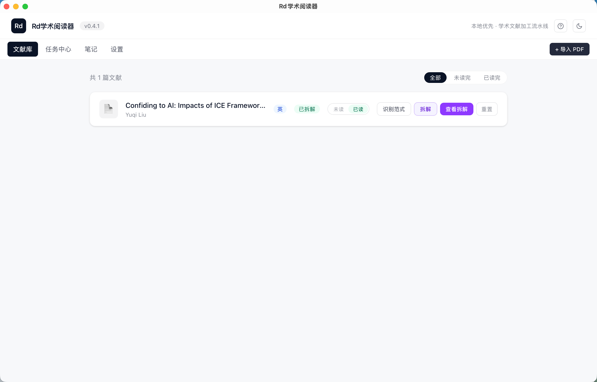
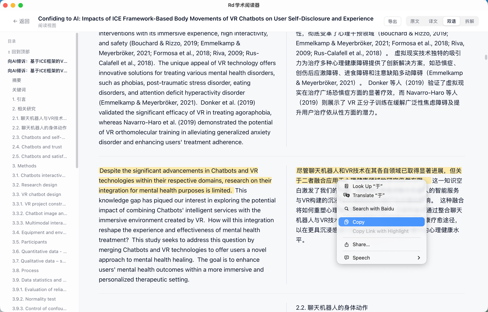
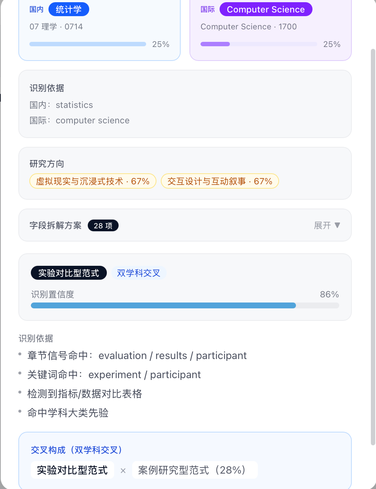
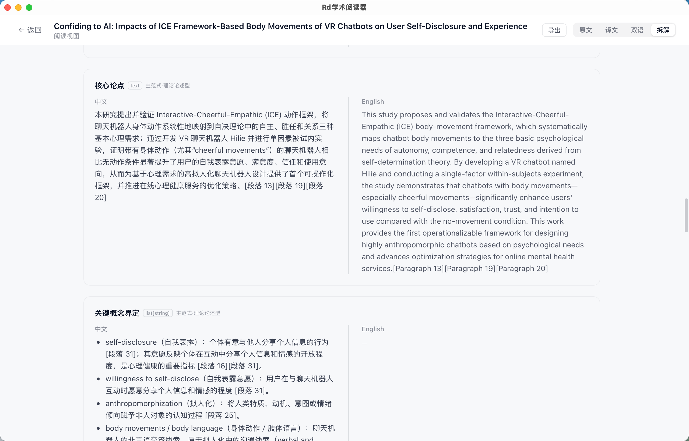
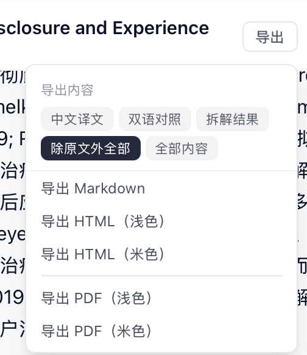
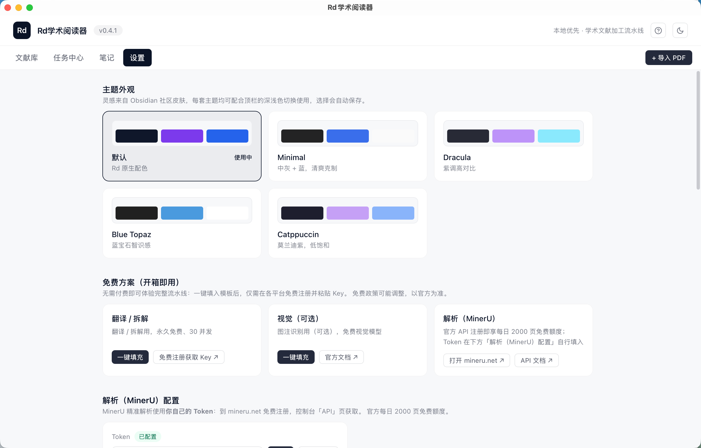
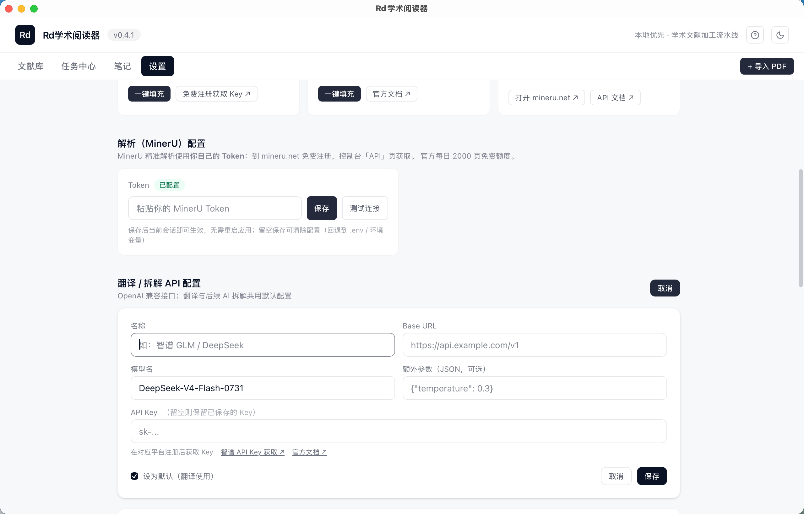

# Rd学术阅读器

本地优先的学术文献加工流水线。导入 PDF 后自动完成版面解析、语言识别、翻译与学科范式拆解，把一篇论文拆成可以直接引用、可以直接复用的结构化产物。

文献、笔记与密钥全部保存在本机，不上传任何内容。



---

## 目录

- [它解决什么问题](#它解决什么问题)
- [设计取向](#设计取向)
- [核心能力](#核心能力)
  - [版面解析](#版面解析把-pdf-变成结构化文本)
  - [双语翻译](#双语翻译原文译文逐段对照)
  - [范式拆解](#范式拆解按学科范式而非固定模板)
  - [阅读与笔记](#阅读与笔记)
  - [按需导出](#按需导出不再一律导出全文)
  - [主题外观](#主题外观)
- [快速开始](#快速开始)
- [支持的八种研究范式](#支持的八种研究范式)
- [隐私与本地优先](#隐私与本地优先)
- [开发与构建](#开发与构建)
- [仓库结构](#仓库结构)

---

## 它解决什么问题

读一篇论文，通常要在几个工具之间来回跳：PDF 阅读器看图，翻译网站查句子，笔记软件记要点，最后还要自己归纳它的研究设计和方法论。散落各处，而且下一次引用时找不到出处。

这个应用把这条链路收进一个本地应用里：**解析 → 识别语言 → 翻译 → 按学科范式拆解 → 导出**。每一步的产物都落盘，可回溯、可修订、可重新执行。

它不做学术判断，只做结构化：拆解结果里的每条结论都必须标注它出自原文哪一段，定位不到就明说"引用缺失"，不编造。

---

## 设计取向

几个刻意的选择，决定了这个工具长成什么样。

**全流程可控，不做黑箱。** 解析、翻译、拆解每一步的产物都落盘，看得见、改得动、可以重来。范式识别会说明它凭什么这么判断（命中了哪些章节信号与关键词）；拆解结论会标注它出自原文哪一段。你可以编辑拆解内容并存为新版本，也可以一键清除某篇文献的处理缓存，换个模型重跑。

**自接 API，而不是绑定订阅。** 翻译与拆解走标准 OpenAI 兼容接口，Base URL、Key、模型名全部开放配置——免费模型和商用模型都只是"一组配置"的区别。密钥只存本机，不经任何中间服务。

**承认人工精读与判断不可替代。** 这个工具承担的是"读之前的准备工作"：把 PDF 变成可检索的结构化文本、把语言障碍降到最低、按学科范式整理出一份待填的分析框架。但一篇文章值不值得引用、它的论证是否成立、方法论有没有漏洞，仍然只能由人来判断。所以它的默认姿态是**呈现证据、等待你的判断**，而不是替你下结论。

**为精读和语言积累服务。** 双语对照支持鼠标悬停时高亮对应句，逐句看清原文是怎么表达的；单击任意一句即可复制该句与对应译文。读一篇论文的同时，也在积累术语和句式。

---

## 核心能力

### 版面解析：把 PDF 变成结构化文本

调用 MinerU 精准解析，输出保留版面的 Markdown —— 标题层级、公式、表格、图片位置都保留下来，成为后续翻译与拆解的输入。

解析产物（含图片资源）按文献归档在本地，随时可重新查看。

### 双语翻译：原文译文逐段对照

自动识别论文语言，中英互译。按 Markdown 结构切分为标题、正文、表格、图注等独立单元分别处理，因此译文能保持原有的层级与排版，而不是变成一大段连续文字。

支持原文 / 译文 / 双语三种视图。双语模式下逐段对照，**鼠标悬停任一句会同时高亮原文与它的对应译文**，句子层面的对应关系一眼可见；**单击任意一句即可复制该句及其译文**，方便摘抄与积累表达。左侧导航跟随滚动，长文阅读时不会迷路。

关于方向：英文论文译为中文；**中文论文译为英文**，并在点击翻译时明确提示方向，避免误操作。中文文献也可以完全跳过翻译，直接进入范式识别与拆解。



*双语视图：左侧目录定位章节，右侧原文与译文逐段对应*

### 范式拆解：按学科范式而非固定模板

这是本项目的核心。**不同的研究范式，评审标准与信息结构本就不同** —— 用一套固定字段去拆解所有论文，得到的只能是泛泛而谈。

应用内建八种研究范式的独立字段库，先识别论文属于哪种范式，再据此组装拆解字段（通用字段 + 范式特有字段，交叉学科则合并多套字段），最后逐字段执行拆解。

识别过程是透明的：主范式、置信度、识别依据（命中了哪些章节信号与关键词）、交叉构成，全部展示出来。



*范式识别：实验对比型 86%、双学科交叉，以及置信度的具体来源*

拆解结果双栏呈现，中英对照。每条结论内联标注它依据的原文段落编号，点击可回到原文位置。**整张条目卡片支持单击复制**（含中英对照），鼠标移入时整条高亮提示，便于把某一维度直接摘到笔记里。



*拆解结果：结论与原文段落一一对应，[段落 13] 这类标注即引用锚点*

上面两张截图对应的是一篇 VR 聊天机器人实验论文：识别为**实验对比型 + 双学科交叉**，字段方案自动组装出 28 项，覆盖实验设置、评价指标、消融分析等实验类范式特有的维度。

### 阅读与笔记

解析结果直接在应用内阅读，公式、表格、图片正常渲染。选中任意文本后**右键即可「复制为摘录（含来源）」**，或存为笔记；笔记是本地 Markdown 文件，可直接在文件系统里查看、编辑、备份，也支持批量管理与导出。

复制与选取是并存的：想精确选某个词、某句话时照常拖选即可，只有**在没有选区的情况下单击**才会触发整句 / 整条复制，不会妨碍精细选取。

### 按需导出

导出不再是"一律导出全文"。可以先选**导出内容**：中文译文、双语对照、拆解结果、除原文外全部、全部内容；再选格式：Markdown、HTML（浅色 / 米色，图片内嵌、自包含可离线打开）、PDF。



*默认「除原文外全部」：原文 PDF 本就在手边，导出译文与拆解更实用*

### 主题外观

五套主题（默认 / Minimal / Dracula / Blue Topaz / Catppuccin），均支持深浅色。灵感来自 Obsidian 社区皮肤，切换即时生效并自动保存。



---

## 快速开始

### 零成本方案（推荐先试）

不付费即可跑通完整流水线：

1. **翻译 / 拆解**：注册智谱开放平台（open.bigmodel.cn），创建 API Key。在「设置 → 免费方案」点「一键填充」写入 GLM-4-Flash 配置，粘贴 Key 保存。该模型永久免费。
2. **版面解析**：注册 mineru.net，在控制台复制 Token，填入「设置 → 解析（MinerU）配置」。每日 2000 页免费额度。
3. 可选：同一平台的视觉模型 Key 填入「视觉（可选）」，用于图注与图片内容识别。

填完可用「测试连接」当场验证 Token 是否有效，无需等到导入文献才发现问题。



*配置页：MinerU Token 与翻译/拆解 API 分别配置，各自的免费方案都有入口*

### 使用自备 API

翻译与拆解采用 OpenAI 兼容接口，Base URL、API Key、模型名均可自定义，兼容任意兼容服务（DeepSeek、智谱、自建网关等）。所有密钥仅保存在本机应用数据库，不参与任何同步。

### 基本流程

导入 PDF（支持选择、拖拽、批量）→ 解析 → （可选）翻译 → 识别范式 → 拆解 → 导出。

已处理过的文献可以随时**重置**：清除解析、翻译、拆解产物并回退状态，原始 PDF 保留，用于换模型重跑或验证不同范式下的拆解效果。

---

## 支持的八种研究范式

| 范式 | 典型学科 |
| --- | --- |
| 实验对比型 | 计算机、工程、人机交互 |
| 对照实验型 | 医学、临床、公共卫生 |
| 实证统计型 | 经济学、社会学、管理学 |
| 理论论述型 | 哲学、文学、传播理论 |
| 案例研究型 | 管理学、社会学、教育学 |
| 综述与元分析型 | 医学、心理学、循证研究 |
| 计算模拟型 | 力学、物理、流体、材料 |
| 设计与构建型 | 设计学、信息系统、数字媒体 |

支持单学科、双学科交叉、多学科交叉三种情况。交叉论文会自动合并主次范式的字段集，冲突时以主范式定义为准。

同时给出国内学科口径（《研究生教育专业目录》）与国际口径（ASJC / WoS）两套学科识别结果，以及研究方向标签。

---

## 隐私与本地优先

- 文献文件、解析结果、翻译产物、笔记、密钥全部保存在本机应用数据目录
- 仅在主动触发时调用你配置的解析 / 翻译 / 视觉服务，不收集任何使用数据
- 内置本地统计（默认关闭），开启后也只记录事件计数与耗时，可随时清空
- 提供诊断面板：环境、配置状态、运行位置与最近日志可一键复制，便于排查问题

---

## 开发与构建

环境要求：Node.js 20+、Rust stable、Tauri 2 CLI。

```bash
npm install
npm run tauri dev        # 本地开发
npm run build            # 前端类型检查 + 构建
npm run tauri build      # 桌面应用打包
```

macOS 双架构（`app,dmg` 都要：app bundle 才能产出应用内更新所需的更新包）：

```bash
npm run tauri build -- --bundles app,dmg --target aarch64-apple-darwin
npm run tauri build -- --bundles app,dmg --target x86_64-apple-darwin
```

发布打包需要签名密钥（否则不生成更新产物）：

```bash
TAURI_SIGNING_PRIVATE_KEY_PATH=~/.tauri/litdesk.key npm run tauri build -- --bundles app,dmg
```

Windows（需在 Windows 上执行，NSIS 必需显式指定）：

```bash
npm run tauri build -- --bundles nsis
```

推送 `v*` 标签会触发 CI 自动构建 macOS（Apple Silicon + Intel）与 Windows 安装包，签名后发布到 Release，并生成应用内更新所需的清单文件。

---

## 仓库结构

```text
src/                 React 前端（文献库、阅读、笔记、设置、帮助）
src-tauri/           Tauri 2 Rust 后端（解析、翻译、范式识别、拆解、导出、数据库）
  src/paradigm.rs    八范式识别器（信号词典 + 实证骨架检测 + 学科识别）
  src/fields.rs      字段模板库与路由引擎
  src/digest.rs      拆解执行器（按字段检索上下文 + 引用锚定）
  src/export.rs      导出组装（内容范围 + 自包含 HTML）
research/            范式知识库、字段定义与拆解方案设计
docs/images/         README 截图
PRD-文献阅读台.md     产品需求文档
开发计划-文献阅读台.md  开发计划
```

---

## 版本与更新

当前版本见界面顶栏，或「设置 → 诊断信息」。版本号在运行时从应用元数据读取，界面显示即为实际运行版本。

「设置 → 软件更新」提供手动检查：**仅在你点击时联网**，不做后台轮询；发现新版本后展示版本号与说明，**确认后**才开始下载（带进度）；下载完成提示重启生效，重启时机由你决定，不会打断手头工作。

更新包经签名校验——签名不匹配会被直接拒绝安装，避免被替换成篡改过的版本。
