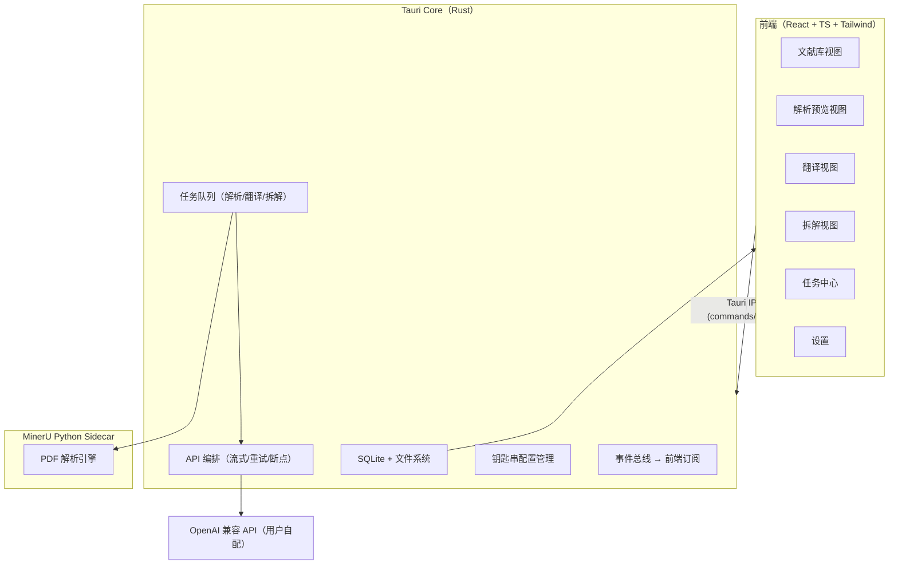
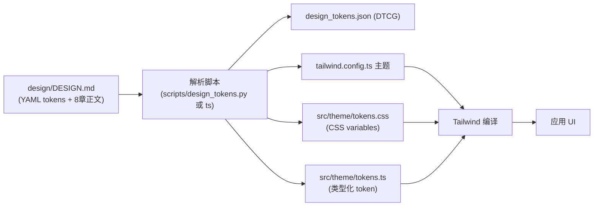

# 开发计划-文献阅读台

创建日期：2026-08-21 ｜ 关联文档：《PRD-文献阅读台.md》 ｜ 目标平台：macOS（优先），架构预留跨平台

---

## 1. 技术选型

| 领域 | 方案 | 备选 | 决策理由 |
|------|------|------|---------|
| 桌面框架 | **Tauri 2** | Electron | macOS 优先；包体 < 10MB（vs Electron 100MB+）；内存占用低；Rust 后端安全边界清晰，适合本地优先 + 钥匙串集成；系统 WebView（WKWebView）原生渲染 |
| 前端 | **React 18 + TypeScript + Vite** | Vue/Svelte | Tauri 官方模板主流组合；生态成熟（markdown 渲染、状态管理） |
| 样式 | **Tailwind CSS v4** | CSS Modules | DESIGN.md 官方导出目标即 Tailwind 主题，可实现"文档即实现" |
| 设计系统 | **DESIGN.md（Google Labs 开放规范）** | — | 见 §3；YAML token → Tailwind 主题 + CSS variables + TS tokens 三端同步 |
| 本地存储 | **SQLite（Rust 端 rusqlite / tauri-plugin-sql）** | JSON 文件 | 文献元数据、任务状态、配置的关系型查询；单文件随应用存放 |
| 解析引擎 | **MinerU（Python sidecar）** | Docker / 独立服务 | MinerU 为 Python 库（支持 MCP）；sidecar 进程随应用按需拉起，避免常驻内存开销；失败可降级为独立安装引导 |
| AI 调用 | **OpenAI 兼容 API（原生 fetch/SSE 流式）** | SDK | 兼容 OpenAI/DeepSeek/智谱/自定义网关等任意三方；用户自填 Base URL + Key |
| 翻译/拆解编排 | **Rust 端任务队列（actor 模型）** | JS 端队列 | 长任务（解析/翻译/拆解）与前端解耦；崩溃恢复、断点续传在 Rust 层保证 |
| Markdown 渲染 | **react-markdown + remark-gfm + KaTeX + rehype-highlight** | marked | MinerU 输出含公式/表格/代码，需 GFM + 数学公式 + 代码高亮全支持 |
| PDF 导出 | **HTML 中转 → WebView printToPDF（macOS）** | Puppeteer / wkhtmltopdf | 免额外依赖；复用 HTML 导出主题管线 |
| 状态管理 | **Zustand** | Redux Toolkit | 轻量；文档库/详情/任务中心状态划分清晰 |
| 打包分发 | **Tauri bundler（.dmg / .app）** | — | 原生打包签名（可选公证） |

### 1.1 MinerU 集成细节（关键决策）

```
Tauri Core (Rust)
   │ 按需启动 / 健康检查 / 版本协商
   ▼
MinerU Python Sidecar（本地 HTTP 或 stdio JSON-RPC）
   │ POST /parse (pdf → markdown+assets)
   │ GET  /progress (事件推送)
   ▼
解析产物：markdown + 图片资源 → 应用数据目录
```

- **MinerU API Key**：已配置于项目根目录 `.env`（`MINERU_API_KEY=sk-71im…Ibuo6`，`MINERU_BASE_URL=https://mineru.net/api/v4`）。解析调用从 `.env` 读取；若后续采用 MinerU 云端 API 替代本地 sidecar，Key 即为此用途；本地 sidecar 与云端 API 双轨的具体接入方式在 M1 启动评审确认 `[To be confirmed]`。
- 进程管理：Rust 端 `tauri-plugin-shell` sidecar 或自定义 spawn + 探活；首次启动自动检测 Python 环境与 mineru 依赖，缺失时引导一键安装（uv 虚拟环境）。
- 协议：优先 HTTP（localhost 随机端口）+ JSON 事件流；解析产物按文献 ID 落盘。
- 降级：sidecar 启动失败 → 应用进入"仅库管理"模式，解析入口展示安装引导；API Key 无效 → 提示前往设置页重新配置。

---

## 2. 架构设计



### 2.1 数据目录与存储

```
~/Library/Application Support/文献阅读台/
├── library.db              # SQLite：文献/任务/配置/版本
├── documents/
│   └── {doc_id}/
│       ├── original.pdf    # 原始 PDF
│       ├── parsed/         # MinerU 产物（md + assets/）
│       ├── translated/     # 翻译结果（分段 json + 合并 md）
│       └── digests/        # 拆解版本（v1.md, v2.md...）
└── settings/               # API 配置（Key 存钥匙串，元数据存库）
```

### 2.2 SQLite 核心表（初版）

| 表 | 关键字段 |
|----|---------|
| documents | id, title, authors, year, journal, tags, file_path, status(枚举), language(语言识别结果), created_at, updated_at |
| tasks | id, doc_id, type(parse/translate/digest), status, progress, stage, error, created_at |
| api_configs | id, name, base_url, model, params(json), key_ref(钥匙串引用), is_default |
| digest_versions | id, doc_id, version, field_schema(json), content(md), score, created_at |
| term_glossary | id, term, translation, language, created_at |

状态枚举（documents.status）：`pending / parsed / translated / digested`（可叠加标签而非互斥 `[Assumption]`，实现时以 tag 数组表达阶段完成标记）。

---

## 3. DESIGN.md 落地（任务 1 交付物的工程化）

### 3.1 双文件体系

项目仓库内维护两个设计文件（与 Stitch 生态对齐）：

1. **`design/DESIGN.md`**——人类可读 + 机器可读设计规范：
   - YAML front matter：colors / typography / rounded / spacing / components（token 引用 `{colors.primary}`）
   - 8 章节固定顺序：Overview → Colors → Typography → Layout & Spacing → Elevation & Depth → Shapes → Components → Do's and Don'ts
2. **`design/design_tokens.json`**——由 DESIGN.md 解析导出（DTCG 格式），作为构建输入。

### 3.2 生成管线



- 解析脚本同时执行 DESIGN.md CLI lint 的 7 项检查（破损 token 引用 / 缺主色 / WCAG AA 对比度 / 孤立 token / token 摘要 / 缺必需章节 / 章节顺序），CI 阶段强制通过。
- 字体决策：正文字体 **Geist**（Stitch 推荐，反模式清单禁 Inter）；学术标题衬线 **Instrument Serif** 或 **Fraunces`[To be confirmed]`**；强调色单一（饱和度 < 80%）。
- 对比度：所有文本/背景 token 组合通过 WCAG AA（正文 ≥ 4.5:1，大字号 ≥ 3:1）。

### 3.3 品味参数落库

Dial 参数（Density 4-6 / Variance 2-4 / Motion 2-4）写入 DESIGN.md 的 Overview 章节，作为组件设计约束：间距体系采用 8px 基准（spacing.unit=8px）、圆角阶梯 xs→full、动效仅用于状态过渡（≤200ms）。

---

## 4. 里程碑与任务拆解

> 时间估算以单人全栈（含设计）为基准 `[Assumption]`，可按团队扩容压缩。

### M1：项目骨架 + 文档库 + 解析（约 5-7 天）

| # | 任务 | 产出 | 验收 |
|---|------|------|------|
| 1.1 | Tauri 2 + React + TS + Tailwind v4 初始化 | 可运行空应用 | `tauri dev` 正常启动 |
| 1.2 | DESIGN.md 编写 + token 解析管线（§3） | design/DESIGN.md + 生成脚本 + tailwind 主题 | lint 7 项通过；UI 字体/色板生效 |
| 1.3 | SQLite schema + 迁移 | library.db 初始化 | 建表/迁移脚本可重复执行 |
| 1.4 | PDF 导入（选择/拖拽/批量） + 文件管理 | 导入命令 + 文档列表 | 重复导入提示；损坏文件拦截 |
| 1.5 | MinerU sidecar 封装（启动/探活/解析调用） | Rust 进程管理 + HTTP 客户端 | 解析成功产出 md+assets |
| 1.6 | 解析任务队列 + 进度事件 | 任务中心 UI + 分阶段进度 | 解析中退出应用可恢复 `[Assumption]` |
| 1.7 | 解析预览视图（图文 Markdown 渲染） | Reader 视图 | KaTeX 公式、表格、图片正确渲染 |

### M2：AI 翻译全链路（约 4-6 天）

| # | 任务 | 产出 | 验收 |
|---|------|------|------|
| 2.1 | API 配置管理（多套 + 钥匙串 + 测试连通） | 设置页 API 模块 | Key 不落明文磁盘 |
| 2.2 | 分段切分算法（标题/正文/图注/表格分治） | translate 分段器（Rust） | 段落边界正确、结构标签保留 |
| 2.3 | 并发调用 + 指数退避重试 + 断点续传 | 翻译执行器 | 单段失败 ≤3 次重试；中断恢复 |
| 2.4 | 流式进度 + 翻译视图（原文/译文/双语） | Trans 视图 | 三模式切换；进度实时 |
| 2.5 | 术语表（命中强制保持） | glossary 模块 | 术语不随翻译漂移 |

### M3：AI 拆解（约 5-7 天）

> 拆解核心已从"3 套固定字段集"升级为"**8 种研究范式驱动的差异化字段库**"。范式知识库见《research/report.md》，决策逻辑见《research/design-schemas.md》，字段定义见《research/fields.yaml》。

| # | 任务 | 产出 | 验收 |
|---|------|------|------|
| 3.1 | 范式识别器：信号词典（8 范式章节/关键词/特殊对象）+ 置信度计算 + JSON 结构化输出（主范式/次范式/置信度/识别依据） | 识别器（json 模式） | 输出含主范式/次范式/置信度/识别依据；置信度阈值可配置 |
| 3.2 | 字段模板库（8 范式特有字段 + 10 通用字段 + 交叉对话字段，YAML 存储）+ 路由引擎（单学科/双学科并集/多学科序列化 + 冲突优先级：人工>主范式>次范式） | 模板 schema + 路由逻辑 | 交叉论文自动组装并集字段；字段可增删并存为自定义模板 |
| 3.3 | 拆解向导四步（范式识别→字段方案→执行→渲染）+ 范式专属拆解指令（8 套差异化 Prompt）+ 范式化排版（表格高亮/流程图区块/矩阵/公式） | Digest 向导 | 人工可修正范式与字段；8 范式渲染模板生效 |
| 3.4 | 引用锚定（拆解结论 ↔ 解析原文段落） | 引用解析器 | 引用缺失显式标记，禁止编造 |
| 3.5 | 流式输出 + 在线编辑 + 版本管理 | 版本对比/回滚 | 保存即版本；可回滚 |

### M4：导出完善 + UI 打磨（约 4-5 天）

| # | 任务 | 产出 | 验收 |
|---|------|------|------|
| 4.1 | md / html 导出（内嵌图片 + ≥2 主题） | 导出模块 | 自包含可离线打开 |
| 4.2 | PDF 导出（HTML 中转 → printToPDF） | PDF 导出 | 中文/公式/表格渲染正确 |
| 4.3 | 空态/加载/错误状态补全 + 动效（Motion 2-4） | UI 打磨 | 全部异常路径有界面反馈 |
| 4.4 | 暗色主题（token 级适配） | 主题切换 | 对比度达标 |

### M5：稳定性 + Beta 发布（约 4-6 天）

| # | 任务 | 产出 | 验收 |
|---|------|------|------|
| 5.1 | 本地统计（默认关闭，事件计数+耗时） | 统计模块 | 可完全关闭 |
| 5.2 | 错误码体系 + 日志 + 崩溃恢复 | 诊断能力 | 可定位问题 |
| 5.3 | 样本集回归（≥10 篇多学科英文 PDF） | 回归测试 | 解析成功率 ≥95% |
| 5.4 | 打包 .dmg + 签名/公证 | Beta 发布包 | 全新机器可安装运行 |

### 总周期

约 **22-31 天**（单人）`[Assumption]`。关键路径：M1 → M3（拆解依赖翻译产物质量）→ M4（导出依赖拆解完成）。

---

## 5. 测试策略

| 层级 | 工具 | 覆盖 |
|------|------|------|
| 单元测试（Rust） | cargo test | 分段切分、状态机、重试逻辑、引用锚定 |
| 单元测试（前端） | Vitest | token 生成、导出模板、状态管理 reducer |
| 集成测试 | Rust 集成测试 + 真实 PDF 样本 | MinerU 解析全链路、翻译/拆解 API 编排（mock 服务） |
| E2E | WebdriverIO / Playwright（Tauri） | 导入→解析→翻译→拆解→导出 主路径 |
| 质量评估 | 人工评分（5 分制，对照 PRD §7） | 拆解结果 ≥4.0；学科识别准确率基线 `[To be confirmed]` |
| 对比度审计 | axe-core + DESIGN.md lint | WCAG AA 通过 |

---

## 6. 依赖与前置条件

| 前置 | 说明 | 状态 |
|------|------|------|
| Rust toolchain + Node ≥ 20 | Tauri 2 开发环境 | 需准备 |
| Python 3.10+ + uv | MinerU sidecar 环境 | 需准备（提供一键脚本） |
| OpenAI 兼容 API Key | 翻译/拆解运行必需 | 用户自备（PRD A4） |
| 设计 token 初稿 | DESIGN.md 首版（含配色/字体/间距） | M1 期间产出 |
| macOS 签名/公证账号（可选） | 正式分发 | M5 阶段处理 |

---

## 7. 实施风险与应对

| 风险 | 应对 |
|------|------|
| MinerU 在 macOS（Apple Silicon）安装兼容问题 | 预构建 wheel 优先；uv 虚拟环境隔离；降级为安装引导；可选切换云端 API（Key 已配置） |
| 长文档翻译成本/时长超预期 | 分段并发上限可配置；成本预估提示（按 token 估算） |
| 拆解质量不达 4.0 | 字段模板与 Prompt 迭代；人工评分样本集驱动改进 |
| DESIGN.md 规范仍为 Alpha | 采用子集（token schema + 8 章结构），核心导出能力不依赖 CLI 工具 |

---

*技术选型中标注 `[Assumption]` 的项在 M1 启动评审时最终确认；本计划随 PRD 假设项确认滚动更新。*
